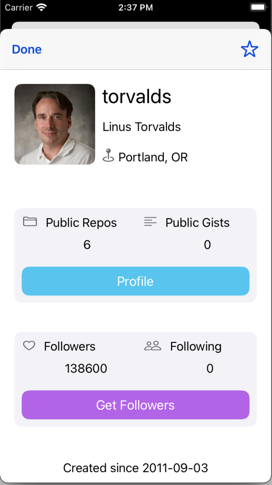

#  О приложении

**Приложение позволяет получить информацию о всех фолловерах юзера.**

# Особености

* Полностью программная работа с View
* Использование URLSession для работы с сетью
* Codable и JSONDecoder для парсинга данных, полученных из сети
* NSCache для кеширования запросов

## Идея была позаимствована у Sean Allen из его платного курса. Спасибо ему за это)))

